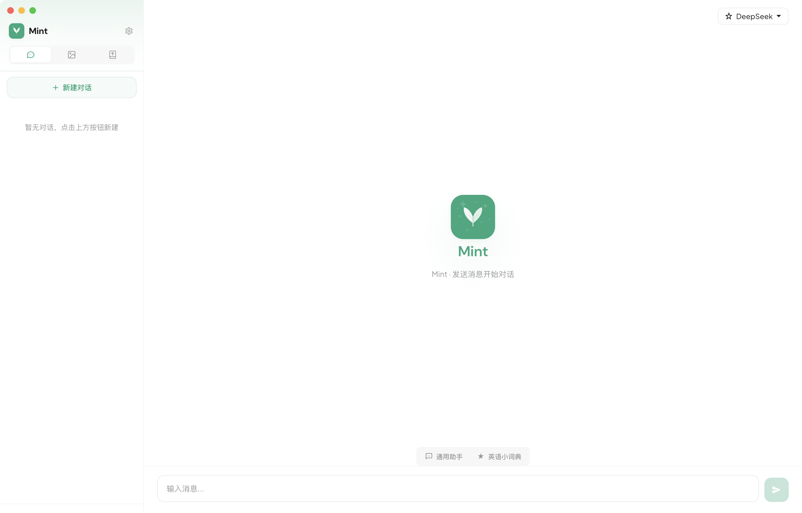
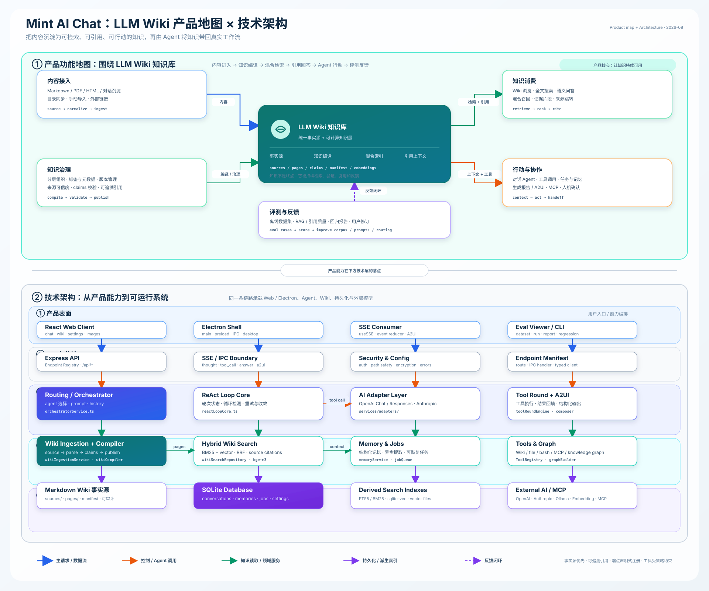

# Mint

[](LICENSE)
[](https://www.electronjs.org/)
[](https://nodejs.org/)
[](https://react.dev/)
[](https://www.typescriptlang.org/)
[](https://vitejs.dev/)
[](https://github.com/dingw530/mint-ai-chat)

Mint 是一款以 LLM Wiki 知识库为核心的 AI 助手，基于 Electron 构建为原生桌面应用。它可以将文档、网页和对话沉淀为可持续使用的知识，并连接任意兼容 OpenAI 的 API 端点；所有数据始终保留在本机。

<p align="center">
  
</p>

## 功能特性

- 原生桌面体验（macOS、Windows、Linux）
- 实时流式响应
- 多对话管理
- 自定义 Agent 与 API 端点配置
- 支持 MCP Server（Model Context Protocol）
- 用户记忆系统，用于保留上下文
- **LLM Wiki 知识库** —— 从文档、URL 和聊天内容构建可检索、可持续积累的 AI 知识库
- **知识库问答** —— 基于 Wiki 知识进行上下文增强对话，帮助用户理解、整理和应用个人知识
- **知识图谱** —— 可视化实体关系图（概念 / 实践 / 方法论），支持从 Wiki 导入内容后自动构建
- 使用 AES-256-GCM 加密存储 API 密钥
- 自定义无边框窗口与标题栏

## 技术栈

- **桌面端**：Electron 33
- **前端**：React 18、Vite 5、使用设计令牌的原生 CSS
- **后端**：Express 4、TypeScript、better-sqlite3（SQLite）
- **IPC**：直接调用服务层（无 HTTP 开销）
- **测试**：Vitest

## 快速开始

### 环境要求

- Node.js 20.18.3

Server、Vitest 和 server 构建脚本会自动校验并使用 Node.js 20.18.3。首次运行前执行：

```bash
nvm install 20.18.3
nvm use
```

Electron 与 Node.js 使用不同的原生模块 ABI，`better-sqlite3` 会保留两份构建产物：

```bash
# server / Vitest：Node ABI 115
npm run rebuild:sqlite -w mint-server

# IPC / Electron：Electron ABI 130
npm run electron:rebuild
```

不要直接在项目根目录执行通用的 `npm rebuild better-sqlite3`，它可能覆盖另一套 ABI。

### 安装

```bash
cd server && npm install
cd client && npm install
cd electron && npm install
```

### 开发模式运行

```bash
# 启动 Electron 应用（自动启动 server 和 client 开发服务器）
npm run electron:dev
```

### 构建桌面应用

```bash
# macOS
npm run electron:build:mac


```

构建产物位于 `electron/release/`。

### 测试

```bash
cd server && npm test
```

## 项目简介

Mint 的核心定位是以 LLM Wiki 知识库为基础的个人 AI 助手：它帮助用户采集、整理、理解和调用个人知识，并在此基础上提供智能对话与自动化能力。

产品围绕以下能力构建：

- **Agent 架构** —— 自定义 Agent 系统，支持系统提示词、自动路由和锁定 Agent 模式
- **ReAct 模式** —— 推理与行动循环：Agent 观察、推理、调用工具，并迭代地将工具结果整合到响应中
- **工具调用** —— 基于 BaseTool 的插件式工具系统，包含 HTTP 请求、Wiki 检索、文件操作等
- **MCP 协议** —— 集成 Model Context Protocol，支持动态管理 MCP Server 连接
- **记忆系统** —— 支持多类别（通用 / 偏好 / 事实）的长期用户记忆与自动召回
- **上下文窗口** —— 使用滑动窗口管理 Token，控制上下文消耗
- **Skills 系统** —— 从本地 Markdown 文件动态加载、热插拔 Skills
- **知识图谱** —— 包含三种节点类型（概念 / 实践 / 方法论）的实体关系图，使用 vis-network 进行力导向渲染，并可从 Wiki 导入内容后自动构建。节点按标签去重；跨批次边通过 AI 指定的关系或共享标签创建。
- **流式响应** —— 基于 SSE 的实时流式响应，按数据块逐步渲染
- **多模型** —— 兼容任意 OpenAI 格式的 API 端点，支持灵活切换模型
- **IPC 架构** —— 在 Electron 主进程中直接调用服务层，绕过 HTTP 开销
- **端到端加密** —— 使用 AES-256-GCM 加密 API 密钥

## 架构

<p align="center">
  
</p>

在 Electron 模式下，应用会在**同一进程内**运行 server：服务模块直接加载到主进程中，并通过 IPC handler 调用，完全绕过 HTTP。这可以消除网络开销，并让渲染进程直接访问服务。

```
渲染进程（React）
    ↕ IPC (contextBridge)
主进程
    ├── 服务层（conversation、message、settings、agent、endpoint、memory、mcp）
    ├── SQLite (better-sqlite3)
    └── AI 代理（兼容 OpenAI 的流式接口）
```

## 项目结构

```
electron/             # Electron 主进程
  main.js             # 创建窗口、IPC handlers、生命周期管理
  preload.js          # 向渲染进程暴露的 contextBridge API
  logger.js           # 基于文件的日志

client/               # React SPA（渲染进程）
  src/
    components/       # UI（Sidebar、ChatArea、Settings、Agents 等）
    hooks/            # useSSE、useIPC
    services/         # API 客户端（自动识别 Electron 与 HTTP）
    styles/           # 设计系统（CSS 自定义属性）

server/               # Express API（TypeScript）
  index.ts            # 入口
  services/           # 业务逻辑层
  repositories/       # 数据访问层（SQLite）
  __tests__/          # 集成测试与单元测试
```

## 许可证

MIT
